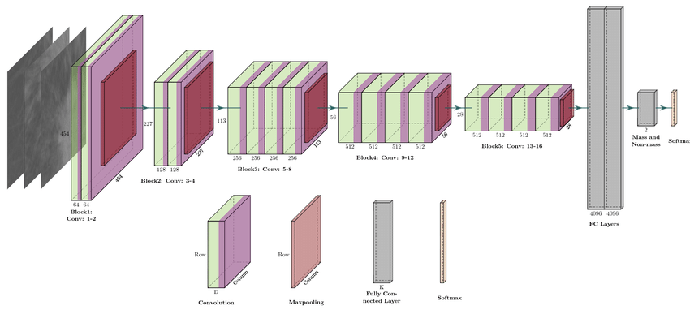
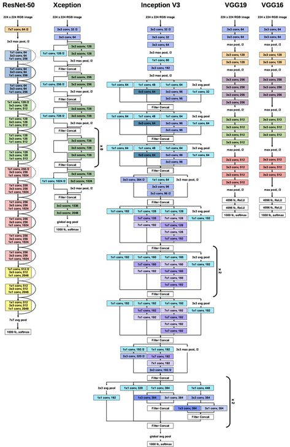

# Malaria_detection
Used deep learning model to predict the images as infected or uninfected 
After trying all the models i chose vgg19 for better accuracy. 
I also build a CNN model from scratch but it was unable to give more accuracy than other transfer learning technique. 
resnet50 is also giving less accuracy as compared to vgg19. 
vgg19 architecture is as follows - 

Detailed architecture of vgg19 along with other great models.

